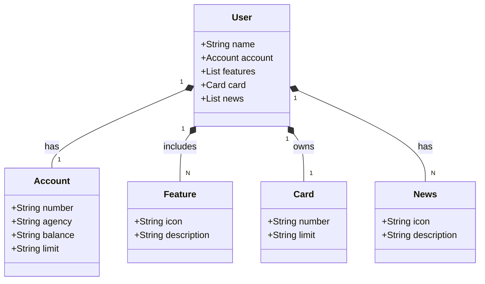

# developmente api for deploy
Java RESTful API.

## Diagrama de Classes

```mermaid

classDiagram
    class User {
        +String name
        +Account account
        +List<Feature> features
        +Card card
        +List<News> news
    }

    class Account {
        +String number
        +String agency
        +String balance
        +String limit
    }

    class Feature {
        +String icon
        +String description
    }

    class Card {
        +String number
        +String limit
    }

    class News {
        +String icon
        +String description
    }

    User "1" *-- "1" Account : has
    User "1" *-- "N" Feature : includes
    User "1" *-- "1" Card : owns
    User "1" *-- "N" News : has
```
